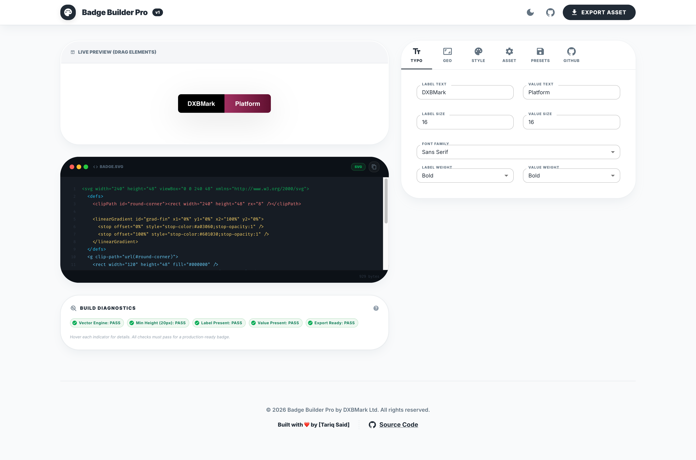

<div align="center">

# 🎨 SVG Badge Builder

**A powerful, fully customizable SVG badge generator for GitHub README files, documentation, and developer portfolios.**

[](https://react.dev/)
[](https://developer.mozilla.org/en-US/docs/Web/JavaScript)
[](https://mui.com/)
[](https://developer.mozilla.org/en-US/docs/Web/SVG)
[](https://vite.dev/)
[](./LICENSE)
[](https://github.com/tariqsaidofficial/badge-builder/releases/tag/v1.0.0)
[](https://tariqsaidofficial.github.io/badge-builder/)

</div>

---

## 🔗 Live Demo

**[🚀 Open Live Demo →](https://tariqsaidofficial.github.io/badge-builder/)**

[](https://tariqsaidofficial.github.io/badge-builder/)

---

## 📸 Preview



---

## ✨ Features

| Feature | Status |
|---|---|
| Live SVG badge preview | ✅ |
| Full control over badge dimensions (width, height, radius) | ✅ |
| Left and right text customization | ✅ |
| Independent font family and weight per section | ✅ |
| Full color controls (backgrounds, text colors) | ✅ |
| Gradient support with custom start/end colors | ✅ |
| Icon presets (built-in library) | ✅ |
| Custom SVG icon upload | ✅ |
| Icon positioning and scaling | ✅ |
| Rounded corners | ✅ |
| Optional configurable outline/border | ✅ |
| Copy generated SVG code | ✅ |
| Download SVG file | ✅ |
| Download PNG file | ✅ |
| Copy README markdown snippet | ✅ |
| Built-in badge presets | ✅ |
| Build diagnostics panel (Shields.io standard checks) | ✅ |
| Safe SVG text escaping and validation | ✅ |
| Dark Mode support | ✅ |
| Drag-and-drop text position editing | ✅ |

---

## 💡 Use Cases

- **GitHub README badges** — Create custom status, version, and tech-stack badges
- **Developer portfolios** — Professional branding for your projects
- **Project documentation** — Consistent visual indicators across docs
- **Open-source branding** — Unique identity for your libraries
- **Product status badges** — Build, deploy, coverage, uptime indicators
- **Internal tools and dashboards** — Custom team or product labels

---

## 🚀 Getting Started

### Prerequisites

- [Node.js](https://nodejs.org/) v18+
- npm or yarn

### Installation

```bash
git clone https://github.com/tariqsaidofficial/badge-builder.git
cd badge-builder
npm install
npm run dev
```

Open your browser at: [http://localhost:5173](http://localhost:5173)

---

## 🏗️ Build for Production

```bash
npm run build
```

Output is placed in the `dist/` directory.

---

## ☁️ Deployment

This project can be deployed to any static hosting platform:

| Platform | Command / Notes |
|---|---|
| **GitHub Pages** | `npm run build` → push `dist/` via gh-pages |
| **Vercel** | Connect repo → auto-build on push |
| **Netlify** | Connect repo → build command: `npm run build` |

---

## 📦 Version

> **Current version: v1.0.0**
>
> See full history in [CHANGELOG.md](./CHANGELOG.md)

---

## 🗺️ Roadmap

| Feature | Status |
|---|---|
| Custom SVG icon upload | ✅ Done |
| PNG export | ✅ Done |
| Drag-and-drop text position editing | ✅ Done |
| Saved custom presets | ✅ Done |
| Theme presets (GitHub, NPM, Shields-style) | ✅ Done |
| Dynamic badge API (generate via URL) | 🔜 Planned |
| Embed generator (iframe widget) | 🔜 Planned |

---

## 🤝 Contributing

Contributions, issues, and feature requests are welcome!

1. Fork the project
2. Create your feature branch: `git checkout -b feat/amazing-feature`
3. Commit your changes: `git commit -m '[TS] Add: amazing feature'`
4. Push to the branch: `git push origin feat/amazing-feature`
5. Open a Pull Request

> ⚠️ For **major changes**, please open an issue first to discuss what you would like to change.

---

## 👤 Author

**Created and maintained by Tariq Said**

- GitHub: [@tariqsaidofficial](https://github.com/tariqsaidofficial)
- Portfolio: [portfolio.dxbmark.com](https://portfolio.dxbmark.com/)

---

## 📄 License

This project is licensed under the **MIT License** — see the [LICENSE](./LICENSE) file for details.

---

<div align="center">

Built with ❤️ by [Tariq Said](https://portfolio.dxbmark.com/)

</div>
